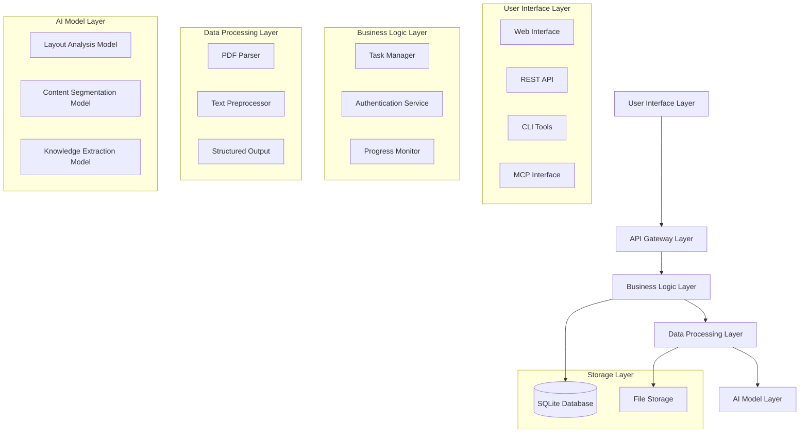
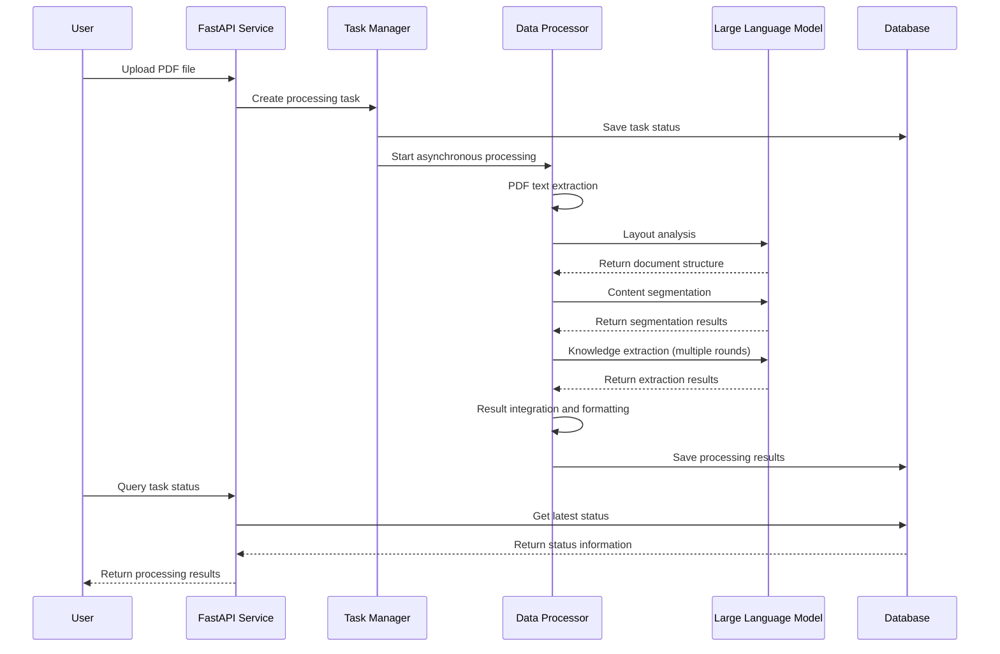

# Medical Knowledge Extraction Service

[](https://www.python.org/)
[](https://fastapi.tiangolo.com/)
[](LICENSE)
[](https://doi.org/10.xxxx)

> 🚀 **AI-Powered Medical Guidelines Knowledge Extraction System**
>
> Specialized intelligent information extraction for medical guideline documents, supporting PDF document processing, structured data output, and real-time task management. Utilizing advanced AI technology to transform complex medical literature into machine-readable and analyzable structured knowledge, facilitating medical knowledge graph construction.

---

## 📋 Table of Contents

- [✨ Core Features](#-core-features)
- [⚡ Quick Start](#-quick-start)
- [🔧 Detailed Installation Guide](#-detailed-installation-guide)
- [📚 Usage Guide](#-usage-guide)
- [🔗 API Documentation](#-api-documentation)
- [🧪 Usage Examples](#-usage-examples)
- [❓ Frequently Asked Questions](#-frequently-asked-questions)
- [🤝 Contributing Guidelines](#-contributing-guidelines)

---

## ✨ Core Features

### 🧠 Intelligent Extraction Capabilities
- **🎯 Medical Specialization**: Extraction strategies specifically optimized for medical guidelines
- **📊 Structured Output**: Seven-column structured data (entity, property, value, entityTag, valueTag, level, valueType)
- **🔄 Multi-Level Processing**: Hierarchical processing of core content + edge information
- **🎖️ Evidence Quality**: Automatic identification of recommendation strength and evidence levels

### 🛠️ Technical Features
- **📄 PDF Processing**: Support for complex PDF document text extraction and layout analysis
- **🚀 Asynchronous Processing**: Background task processing, supporting large files and batch operations
- **📡 Real-time Progress**: WebSocket real-time progress feedback
- **🔐 Secure Authentication**: API key-based secure access control
- **🔌 MCP Support**: Model Context Protocol integration, supporting third-party tool calls

### 💡 User Experience
- **🎛️ Multiple Interfaces**: RESTful API + CLI Tools + Web Interface
- **📱 Cross-Platform**: Support for Windows, macOS, Linux
- **🌐 Internationalization**: Support for Chinese and English medical literature processing
- **📊 Result Visualization**: Tabular display of structured data

---

## ⚡ Quick Start

### 🚀 30-Second Quick Experience

#### Method 1: Direct Launch (Recommended)
```bash
# Clone the project
git clone https://github.com/Dustzm/Medical_Guideline_Extract.git
cd knowledge-extract

# Install dependencies
pip install -r requirements.txt

# Configure environment variables (copy and edit)
cp example.env .env
# Edit the .env file, fill in your large model API key
...
# Start the service
python starter.py
```

### 🔧 Command Line Tool Usage

```bash
# Determine if text is a medical guideline
python backend/mcp_support/judge.py "Acute myocardial infarction diagnosis and treatment guidelines..."

# Extract knowledge (output to console)
python backend/mcp_support/extract.py "Hypertension prevention and treatment guidelines 2024..."

# Extract knowledge (save to file)
python backend/mcp_support/extract.py "Diabetes diagnosis and treatment guidelines..." --output result.txt

# Process from file
python backend/mcp_support/extract.py --file medical_guideline.txt
```

---

## 🔧 Detailed Installation Guide

### 📋 System Requirements

- **Operating System**: Windows 10+, macOS 10.14+, Ubuntu 18.04+
- **Python Version**: Python 3.8 or higher
- **Memory Requirements**: Minimum 2GB RAM, recommended 8GB+
- **Storage Space**: At least 2GB available space

### 🐍 Python Environment Configuration

#### Using Conda (Recommended)
```bash
# Create virtual environment
conda create -n medical-extract python=3.10
conda activate medical-extract

# Install dependencies
pip install -r requirements.txt
```

#### Using venv
```bash
# Create virtual environment
python -m venv medical-extract-env

# Activate environment
# Windows
medical-extract-env\Scripts\activate
# macOS/Linux
source medical-extract-env/bin/activate

# Install dependencies
pip install -r requirements.txt
```

### 🔑 Environment Variable Configuration

1. **Copy environment variable template**:
```bash
cp example.env .env
```

2. **Edit `.env` file**:
```env
# Application basic configuration
APP_NAME=Knowledge_Extractor_For_Medical_Guidelines

# Large model API configuration
API_URL=https://your_api_provider/v1/chat/completions
MODEL_ID=qwen3-30b
API_KEY=your_api_key_here
```

### 🚦 Startup Verification

```bash
# Start the service
python starter.py

# Verify service
curl http://localhost:8999/medicalGuideLine/knowledgeExtract/public/check

# Expected response
{
  "status": "ok",
  "message": "服务运行正常",
  "version": "1.0.0"
}
```

---

## 📚 Usage Guide

### 🔌 API Integration Usage

#### Python Example
```python
import requests
import json

# API base URL
BASE_URL = "http://localhost:8999/medicalGuideLine/knowledgeExtract"

# Create API key
def create_api_key():
    response = requests.post(f"{BASE_URL}/public/create-api-key")
    return response.json()['api_key']

# Upload PDF file for extraction
def extract_from_pdf(file_path, api_key):
    headers = {"X-API-Key": api_key}
    with open(file_path, 'rb') as f:
        files = {'file': f}
        response = requests.post(
            f"{BASE_URL}/extract",
            headers=headers,
            files=files
        )
    return response.json()

# Usage example
api_key = create_api_key()
result = extract_from_pdf("medical_guideline.pdf", api_key)
print(json.dumps(result, ensure_ascii=False, indent=2))
```

#### JavaScript Example
```javascript
// Create API key
async function createApiKey() {
  const response = await fetch('/medicalGuideLine/knowledgeExtract/public/create-api-key', {
    method: 'POST'
  });
  const data = await response.json();
  return data.api_key;
}

// File upload processing
async function uploadFile(file, apiKey) {
  const formData = new FormData();
  formData.append('file', file);

  const response = await fetch('/medicalGuideLine/knowledgeExtract/extract', {
    method: 'POST',
    headers: {
      'X-API-Key': apiKey
    },
    body: formData
  });

  return await response.json();
}

// Usage example
document.getElementById('upload-form').addEventListener('submit', async (e) => {
  e.preventDefault();
  const fileInput = document.getElementById('file-input');
  const file = fileInput.files[0];

  if (file) {
    const apiKey = await createApiKey();
    const result = await uploadFile(file, apiKey);
    console.log('Extraction result:', result);
  }
});
```

### 📊 Result Data Format

Extraction results are structured as seven-column tabular data:

| entity | property | value | entityTag | valueTag | level | valueType |
|--------|----------|-------|-----------|----------|--------|-----------|
| 本指南 | 基本信息 | 基本信息 | 主实体 | 临床实践指南基本信息 | 1 | text |
| 基本信息 | 中文标题 | 急性心肌梗死诊断和治疗指南 | 临床实践指南基本信息 | Literal | 2 | text |
| 指南内容 | 诊断标准 | 持续性胸痛超过30分钟 | 临床实践指南内容 | 诊断标准 | 3 | text |

#### Field Description
- **entity**: Entity name
- **property**: Property name
- **value**: Property value
- **entityTag**: Entity type tag
- **valueTag**: Value type tag
- **level**: Hierarchical depth
- **valueType**: Data type of the value

### 📈 Batch Processing

```python
# Batch process multiple PDF files
import os
import requests
from concurrent.futures import ThreadPoolExecutor

def batch_process_pdfs(pdf_folder, api_key):
    pdf_files = [f for f in os.listdir(pdf_folder) if f.endswith('.pdf')]
    headers = {"X-API-Key": api_key}

    def process_single_pdf(pdf_file):
        file_path = os.path.join(pdf_folder, pdf_file)
        with open(file_path, 'rb') as f:
            files = {'file': f}
            response = requests.post(
                "http://localhost:8999/medicalGuideLine/knowledgeExtract/extract",
                headers=headers,
                files=files
            )
        return pdf_file, response.json()

    # Concurrent processing (maximum 5 concurrent)
    with ThreadPoolExecutor(max_workers=5) as executor:
        results = list(executor.map(process_single_pdf, pdf_files))

    return results

# Usage example
results = batch_process_pdfs("./medical_guidelines/", "your_api_key")
for filename, result in results:
    print(f"{filename}: {len(result.get('data', []))} records extracted successfully")
```

---

## 🔗 API Documentation

### 🔐 Authentication Mechanism

The system uses API keys for authentication. All interfaces except public ones require including an API key in the request header:

```http
X-API-Key: your_api_key_here
```

### 📋 Interface List

#### Public Interfaces (No Authentication Required)

##### 1. Health Check
```http
GET /medicalGuideLine/knowledgeExtract/public/check
```

**Response Example**:
```json
{
  "status": "ok",
  "message": "服务运行正常",
  "version": "1.0.0",
  "services": {
    "fastapi": "running",
    "mcp": "running"
  }
}
```

##### 2. Create API Key
```http
POST /medicalGuideLine/knowledgeExtract/public/create-api-key
```

**Response Example**:
```json
{
  "api_key": "sk-xxxxx...",
  "name": "default_key",
  "created_at": "2024-01-01T00:00:00Z",
  "message": "API密钥创建成功"
}
```

#### Authenticated Interfaces

##### 1. PDF File Knowledge Extraction
```http
POST /medicalGuideLine/knowledgeExtract/extract
Content-Type: multipart/form-data
X-API-Key: your_api_key
```

**Request Parameters**:
- `file`: PDF file (required)

**Response Example**:
```json
{
  "task_id": "task_123456",
  "status": "processing",
  "message": "文件上传成功，开始处理",
  "progress": 0
}
```

##### 2. Query Task Status
```http
GET /medicalGuideLine/knowledgeExtract/task/{task_id}
X-API-Key: your_api_key
```

**Response Example**:
```json
{
  "task_id": "task_123456",
  "status": "completed",
  "progress": 100,
  "message": "处理完成",
  "result": [
    {
      "entity": "本指南",
      "property": "基本信息",
      "value": "基本信息",
      "entityTag": "主实体",
      "valueTag": "临床实践指南基本信息",
      "level": 1,
      "valueType": "text"
    }
  ],
  "start_time": "2024-01-01T00:00:00Z",
  "end_time": "2024-01-01T00:01:30Z"
}
```

##### 3. Get Task List
```http
GET /medicalGuideLine/knowledgeExtract/tasks?limit=10&offset=0
X-API-Key: your_api_key
```

##### 4. Delete Task Record
```http
DELETE /medicalGuideLine/knowledgeExtract/task/{task_id}
X-API-Key: your_api_key
```

### 📊 Response Format

#### Success Response
```json
{
  "success": true,
  "data": {...},
  "message": "操作成功"
}
```

#### Error Response
```json
{
  "success": false,
  "error": {
    "code": "INVALID_API_KEY",
    "message": "API密钥无效或已过期",
    "details": {...}
  }
}
```

#### Error Code Description
- `INVALID_API_KEY`: API key is invalid
- `FILE_TOO_LARGE`: File size exceeds limit
- `UNSUPPORTED_FORMAT`: Unsupported file format
- `PROCESSING_ERROR`: Error occurred during processing
- `RATE_LIMIT_EXCEEDED`: Request frequency exceeds limit

---

## 🏗️ System Architecture

### 📐 Overall Architecture Diagram



### 🔧 Core Components

#### 1. FastAPI Service (Port 8999)
- **Route Management**: API request distribution and routing
- **Authentication Middleware**: API key verification and permission control
- **Task Scheduling**: Asynchronous task creation and status management
- **Response Processing**: Result serialization and formatting

#### 2. MCP Service (Port 8998)
- **Tool Registration**: Registration and discovery of knowledge extraction tools
- **Protocol Adaptation**: Model Context Protocol protocol implementation
- **Streaming Transmission**: Real-time data stream processing
- **Third-party Integration**: Support for external toolchain integration

#### 3. Data Processing Engine
- **PDF Parsing**: PyPDF2-based text extraction
- **Layout Analysis**: LLM-driven document structure recognition
- **Content Segmentation**: Intelligent paragraph and section segmentation
- **Knowledge Extraction**: Multi-round LLM calls and result integration

#### 4. Storage System
- **Task Database**: SQLite storage for task status and results
- **File Storage**: Local file system storage for uploaded files
- **Cache System**: Memory cache to improve response speed

### 🔄 Data Flow



---

## 🧪 Usage Examples

### 🩺 Clinical Medicine Scenarios

#### Scenario 1: Cardiovascular Disease Guidelines Analysis
```python
# Analyze acute myocardial infarction diagnosis and treatment guidelines
cardiology_text = """
Acute Myocardial Infarction Diagnosis and Treatment Guidelines (2024 Edition)

Diagnostic Criteria:
1. Persistent chest pain lasting more than 30 minutes
2. ECG shows ST segment elevation ≥1mm
3. Significant elevation of cardiac enzymes (CK-MB, troponin)

Treatment Plan:
- Immediate administration of aspirin 300mg chewable
- Early PCI intervention (target time <90 minutes)
- Beta-blockers (if no contraindications)
- Intensive statin therapy

Recommendation Grade: Class I recommendation, Evidence Level A
"""

# Use CLI tool for processing
result = subprocess.run([
    'python', 'backend/mcp_support/extract.py',
    cardiology_text
], capture_output=True, text=True)

print("Extraction results:")
print(result.stdout)
```

**Output Example**:
```
entity	property	value	entityTag	valueTag	level	valueType
本指南	基本信息	基本信息	主实体	临床实践指南基本信息	1	text
基本信息	中文标题	急性心肌梗死诊断和治疗指南（2024年版）	临床实践指南基本信息	Literal	2	text
指南内容	诊断标准	持续性胸痛超过30分钟	临床实践指南内容	诊断标准	3	text
指南内容	诊断标准	心电图显示ST段抬高≥1mm	临床实践指南内容	诊断标准	3	text
指南内容	治疗方案	阿司匹林300mg嚼服	临床实践指南内容	药物治疗	3	text
指南内容	推荐等级	I类推荐	临床实践指南内容	推荐等级	4	text
指南内容	证据水平	证据水平A	临床实践指南内容	证据等级	4	text
```

#### Scenario 2: Drug Interaction Extraction
```python
# Extract drug information from multiple guidelines
medications = [
    "Hypertension guidelines: ACEI+ARB combination not recommended",
    "Diabetes guidelines: Metformin+SGLT2 inhibitor synergistic effect",
    "Heart failure guidelines: Beta-blocker+ACEI standardized treatment"
]

all_results = []
for med_text in medications:
    result = call_extract_command(content=med_text)
    all_results.append(result)

# Integrate drug interaction data
drug_interactions = []
for result in all_results:
    lines = result.strip().split('\n')
    for line in lines[1:]:  # Skip header
        parts = line.split('\t')
        if len(parts) >= 6 and '药物' in parts[3]:
            drug_interactions.append({
                'drug': parts[0],
                'interaction': parts[1],
                'description': parts[2],
                'level': parts[5]
            })

print("Drug interaction data:")
for interaction in drug_interactions:
    print(f"- {interaction['drug']}: {interaction['description']}")
```

### 🔬 Research Scenarios

#### Scenario 3: Large-Scale Guidelines Batch Analysis
```python
import pandas as pd
import os
from concurrent.futures import ThreadPoolExecutor

def analyze_medical_guidelines(guidelines_folder):
    """Batch analysis of medical guideline files"""

    # Get all PDF files
    pdf_files = [f for f in os.listdir(guidelines_folder)
                if f.endswith('.pdf')]

    # Create API key
    api_key = create_api_key()

    def process_guideline(pdf_file):
        """Process single guideline file"""
        try:
            # Upload file and get task ID
            with open(os.path.join(guidelines_folder, pdf_file), 'rb') as f:
                files = {'file': f}
                headers = {'X-API-Key': api_key}
                response = requests.post(
                    'http://localhost:8999/medicalGuideLine/knowledgeExtract/extract',
                    headers=headers, files=files
                )

            task_id = response.json()['task_id']

            # Wait for processing completion
            while True:
                status_response = requests.get(
                    f'http://localhost:8999/medicalGuideLine/knowledgeExtract/task/{task_id}',
                    headers={'X-API-Key': api_key}
                )
                status = status_response.json()

                if status['status'] == 'completed':
                    return {
                        'filename': pdf_file,
                        'task_id': task_id,
                        'records_count': len(status.get('result', [])),
                        'processing_time': status.get('end_time') - status.get('start_time'),
                        'data': status.get('result', [])
                    }
                elif status['status'] == 'failed':
                    return {
                        'filename': pdf_file,
                        'task_id': task_id,
                        'error': status.get('message'),
                        'records_count': 0
                    }

                time.sleep(2)  # Wait 2 seconds before re-querying

        except Exception as e:
            return {
                'filename': pdf_file,
                'error': str(e),
                'records_count': 0
            }

    # Concurrent processing of multiple files
    with ThreadPoolExecutor(max_workers=3) as executor:
        results = list(executor.map(process_guideline, pdf_files))

    # Generate analysis report
    total_records = sum(r['records_count'] for r in results if 'records_count' in r)
    successful_files = len([r for r in results if 'error' not in r])

    print(f"Batch analysis completed:")
    print(f"- Number of files processed: {len(pdf_files)}")
    print(f"- Successfully processed: {successful_files}")
    print(f"- Total records: {total_records}")
    print(f"- Success rate: {successful_files/len(pdf_files)*100:.1f}%")

    return results

# Usage example
results = analyze_medical_guidelines("./medical_guidelines_collection/")

# Save to Excel file
df_data = []
for result in results:
    if 'data' in result:
        for record in result['data']:
            record['source_file'] = result['filename']
            df_data.append(record)

if df_data:
    df = pd.DataFrame(df_data)
    df.to_excel('medical_guidelines_extracted.xlsx', index=False)
    print("Results saved to medical_guidelines_extracted.xlsx")
```

---

## ❓ Frequently Asked Questions

### 🚀 Installation and Startup Issues

**Q: What should I do if port is occupied during startup?**
```bash
# Check port usage
lsof -i :8999
lsof -i :8998

# Modify port number in configuration file
# Edit backend/config.py
# Or set environment variables
export FASTAPI_PORT=8997
export MCP_PORT=8996
```

**Q: What should I do if dependency installation fails?**
```bash
# Upgrade pip
pip install --upgrade pip

# Use domestic mirror sources
pip install -r requirements.txt -i https://pypi.tuna.tsinghua.edu.cn/simple/

# Install dependencies individually
pip install fastapi uvicorn PyPDF2 pandas
```

### 📄 File Processing Issues

**Q: What PDF formats are supported?**
- Support standard PDF format (.pdf)
- Recommended file size not exceeding 50MB
- Support Chinese and English PDFs
- Does not support scanned PDFs (image format)

### 🔌 API Usage Issues

**Q: What are the API request frequency limits?**
- Determined by model provider, supports local deployment

**Q: How to handle long-running tasks?**
```python
# Asynchronous task processing
task_id = upload_file_return_task_id("large_file.pdf")

# Poll task status
while True:
    status = check_task_status(task_id)
    if status['status'] == 'completed':
        break
    elif status['status'] == 'failed':
        print("Processing failed")
        break
    time.sleep(5)
```

**Q: What to do if extraction results are inaccurate?**
- Ensure input is standard medical guideline text with clear structure, such as clinical questions-recommendations-evidence, with well-defined article hierarchy
- Check PDF quality, avoid blurred or scanned versions

### 💾 Data Storage Issues

**Q: Where is data stored?**
- SQLite database: `knowledge_extract.db`
- Uploaded files: `backend/uploads/` directory
- Processing results: Database + optional file export

---

## 🤝 Contributing Guidelines

We welcome all forms of contributions! Please read the following guidelines to learn how to participate in the project.

### 🎯 Contribution Types

- 🐛 **Bug Reports**: Discover and report issues
- 💡 **Feature Suggestions**: Propose new feature ideas
- 📝 **Documentation Improvements**: Enhance documentation and examples
- 🔧 **Code Contributions**: Submit code fixes or new features
- 🧪 **Test Cases**: Add or improve tests
- 🌐 **Internationalization**: Help with translation and localization

### 🚀 Quick Start

1. **Fork the project** to your GitHub account
2. **Clone your fork**:
```bash
git clone https://github.com/YOUR_USERNAME/knowledge-extract.git
cd knowledge-extract
```

3. **Create development branch**:
```bash
git checkout -b feature/your-feature-name
```

4. **Install development dependencies**:
```bash
pip install -r requirements.txt
pip install -r requirements-dev.txt  # If available
```

5. **Make changes** and ensure code passes tests

6. **Commit changes**:
```bash
git add .
git commit -m "feat: Add new feature description"
```

7. **Push to fork**:
```bash
git push origin feature/your-feature-name
```

8. **Create Pull Request**

### 📝 Code Standards

#### Python Code Style
- Use **PEP 8** code style
- Use **type hints** (Type Hints)
- Functions and classes need **docstrings**
- Use meaningful names for variables and functions

```python
# Good example
def extract_medical_knowledge(
    pdf_content: bytes,
    api_key: str,
    model_name: str = "qwen3-30b"
) -> List[Dict[str, Any]]:
    """
    Extract medical knowledge from PDF content

    Args:
        pdf_content: Binary content of PDF file
        api_key: API authentication key
        model_name: Model name to use

    Returns:
        List of dictionaries containing structured medical knowledge

    Raises:
        APIConnectionError: API connection failed
        ValidationError: Input data validation failed
    """
    pass
```

#### Commit Message Standards
Use [Conventional Commits](https://www.conventionalcommits.org/) format:

```
<type>[optional scope]: <description>

[optional body]

[optional footer]
```

- `feat`: New feature
- `fix`: Bug fix
- `docs`: Documentation update
- `style`: Code format adjustment
- `refactor`: Code refactoring
- `test`: Test related
- `chore`: Build process or auxiliary tool changes

Example:
```
feat(extract): Add drug interaction detection feature

- Add drug contraindication checks
- Update prompt templates
- Add related test cases

Closes #123
```

### 🧪 Testing Guidelines

#### Running Tests
```bash
# Run all tests
python -m pytest

# Run specific test file
python -m pytest tests/test_extract.py

# Run tests and generate coverage report
python -m pytest --cov=backend tests/
```

#### Writing Tests
- Write unit tests for new features
- Test coverage should be maintained above 80%
- Use meaningful test data and assertions

```python
import pytest
from backend.extract_service import extract_knowledge

class TestMedicalExtraction:
    def test_extract_cardiology_guideline(self):
        """Test cardiology guideline extraction"""
        test_text = """
        Acute myocardial infarction diagnosis and treatment guidelines
        Diagnostic criteria: Persistent chest pain lasting more than 30 minutes...
        """

        result = extract_knowledge(test_text)

        assert len(result) > 0
        assert any("myocardial infarction" in item['value'] for item in result)
        assert all('entity' in item and 'value' in item for item in result)
```

### 📖 Documentation Contributions

- API documentation updates need to include request/response examples
- New features need usage examples
- Code comments in English, user documentation in Chinese
- Maintain documentation accuracy and timeliness

### 🐛 Bug Reports

When reporting bugs using GitHub Issues, please include:

1. **Environment Information**: Operating system, Python version, dependency versions
2. **Reproduction Steps**: Detailed reproduction steps
3. **Expected Behavior**: Describe what you expect to happen
4. **Actual Behavior**: Describe what actually happened
5. **Error Logs**: Complete error stack trace
6. **Related Files**: If it's a file processing issue, provide test files

### 💡 Feature Suggestions

When proposing new features, please explain:

1. **Use Case**: What problem does this feature solve
2. **Expected Benefits**: What value does it bring to users or the project
3. **Implementation Ideas**: If you have ideas, describe implementation approach
4. **Priority**: High/Medium/Low priority

---

<div align="center">

**🎉 Thank you for using the Medical Knowledge Extraction System!**

If this project helps you, please give us a ⭐ Star!

[](https://star-history.com/#wust-ontoweb/knowledge-extract&Date)

*Last updated: January 2024*

</div>