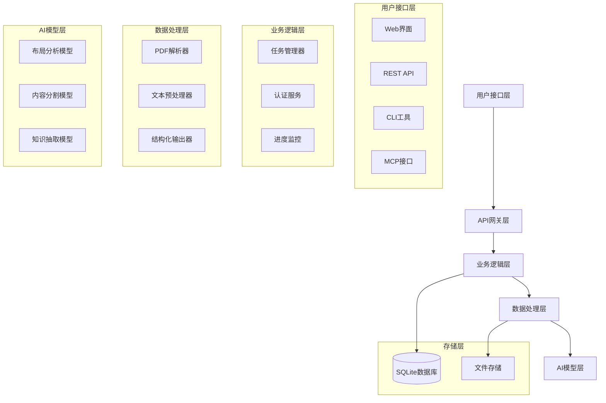
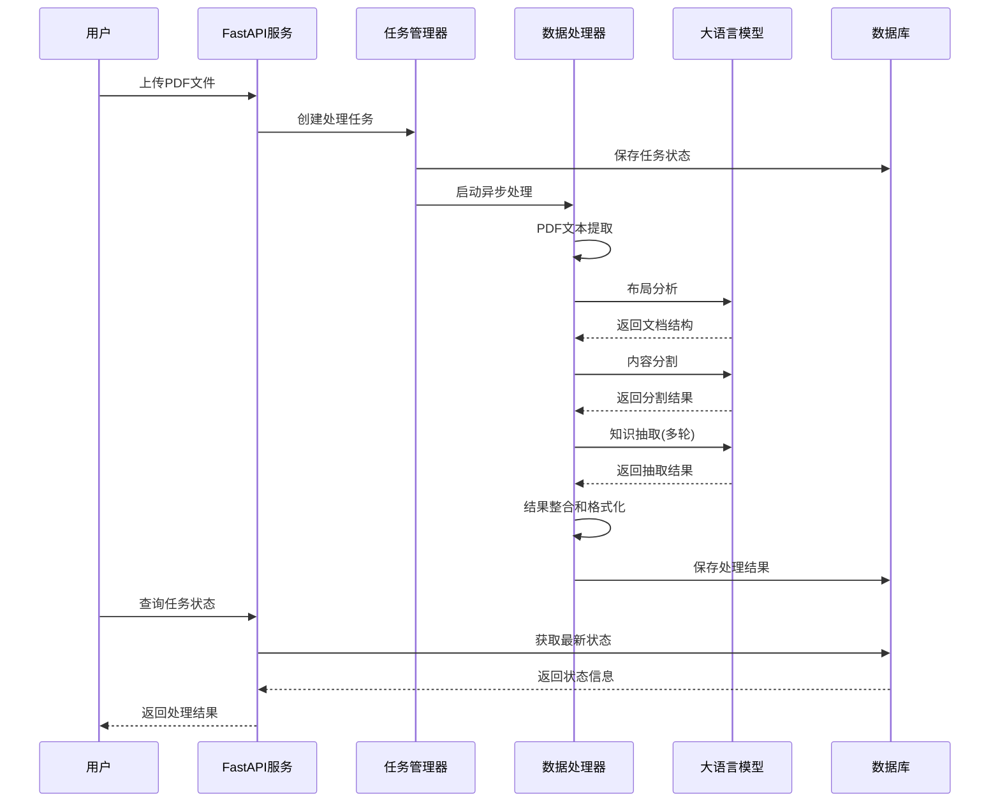

# 医疗知识提取服务 (Medical Knowledge Extraction)

[](https://www.python.org/)
[](https://fastapi.tiangolo.com/)
[](LICENSE)
[](https://doi.org/10.xxxx)

<div align="center">

[**English**](README.md) | **简体中文**

</div>

> 🚀 **基于大语言模型的智能医学指南知识抽取系统**
>
> 专门针对医学指南文档的智能信息提取，支持PDF文档处理、结构化数据输出和实时任务管理。利用先进的AI技术，将复杂的医学文献转化为可机读、可分析的结构化知识，助力医学知识图谱构建。

---
## 📋 目录

- [✨ 核心特性](#-核心特性)
- [⚡ 快速开始](#-快速开始)
- [🔧 详细安装指南](#-详细安装指南)
- [📚 使用指南](#-使用指南)
- [🔗 API 文档](#-api-文档)
- [🧪 使用示例](#-使用示例)
- [❓ 常见问题](#-常见问题)
- [🤝 贡献指南](#-贡献指南)

---

## ✨ 核心特性

### 🧠 智能抽取能力
- **🎯 医学专业性**: 专门针对医学指南优化的抽取策略
- **📊 结构化输出**: 七列结构化数据 (entity, property, value, entityTag, valueTag, level, valueType)
- **🔄 多级处理**: 核心内容 + 边缘信息的分层处理
- **🎖️ 证据质量**: 自动识别推荐强度和证据等级

### 🛠️ 技术特性
- **📄 PDF处理**: 支持复杂PDF文档的文本提取和布局分析
- **🚀 异步处理**: 后台任务处理，支持大文件和批量操作
- **📡 实时进度**: WebSocket实时进度反馈
- **🔐 安全认证**: 基于API密钥的安全访问控制
- **🔌 MCP支持**: Model Context Protocol集成，支持第三方工具调用

### 💡 用户体验
- **🎛️ 多种接口**: RESTful API + CLI工具 + Web界面
- **📱 跨平台**: 支持Windows、macOS、Linux
- **🌐 国际化**: 支持中英文医学文献处理
- **📊 结果可视化**: 结构化数据的表格化展示
---

## ⚡ 快速开始

### 🚀 30秒快速体验

#### 方式一：直接启动（推荐）
```bash
# 克隆项目
git clone https://github.com/Dustzm/Medical_Guideline_Extract.git
cd knowledge-extract

# 安装依赖
pip install -r requirements.txt

# 配置环境变量（复制并编辑）
cp example.env .env
# 编辑 .env 文件，填入你的大模型API密钥
...
# 启动服务
python starter.py
```

### 🔧 命令行工具使用

```bash
# 判断文本是否为医疗指南
python backend/mcp_support/judge.py "急性心肌梗死诊断和治疗指南..."

# 提取知识（输出到控制台）
python backend/mcp_support/extract.py "高血压防治指南2024年版..."

# 提取知识（保存到文件）
python backend/mcp_support/extract.py "糖尿病诊疗指南..." --output result.txt

# 从文件处理
python backend/mcp_support/extract.py --file medical_guideline.txt
```

---

## 🔧 详细安装指南

### 📋 系统要求

- **操作系统**: Windows 10+, macOS 10.14+, Ubuntu 18.04+
- **Python版本**: Python 3.8 或更高版本
- **内存要求**: 最小 2GB RAM，推荐 8GB+
- **存储空间**: 至少 2GB 可用空间

### 🐍 Python 环境配置

#### 使用 Conda（推荐）
```bash
# 创建虚拟环境
conda create -n medical-extract python=3.10
conda activate medical-extract

# 安装依赖
pip install -r requirements.txt
```

#### 使用 venv
```bash
# 创建虚拟环境
python -m venv medical-extract-env

# 激活环境
# Windows
medical-extract-env\Scripts\activate
# macOS/Linux
source medical-extract-env/bin/activate

# 安装依赖
pip install -r requirements.txt
```

### 🔑 环境变量配置

1. **复制环境变量模板**:
```bash
cp example.env .env
```

2. **编辑 `.env` 文件**:
```env
# 应用基础配置
APP_NAME=Knowledge_Extractor_For_Medical_Guidelines

# 大模型API配置
API_URL=https://your_api_provider/v1/chat/completions
MODEL_ID=qwen3-30b
API_KEY=your_api_key_here
```

### 🚦 启动验证

```bash
# 启动服务
python starter.py

# 验证服务
curl http://localhost:8999/medicalGuideLine/knowledgeExtract/public/check

# 预期响应
{
  "status": "ok",
  "message": "服务运行正常",
  "version": "1.0.0"
}
```

---

## 📚 使用指南

### 🔌 API集成使用

#### Python 示例
```python
import requests
import json

# API基础URL
BASE_URL = "http://localhost:8999/medicalGuideLine/knowledgeExtract"

# 创建API密钥
def create_api_key():
    response = requests.post(f"{BASE_URL}/public/create-api-key")
    return response.json()['api_key']

# 上传PDF文件抽取
def extract_from_pdf(file_path, api_key):
    headers = {"X-API-Key": api_key}
    with open(file_path, 'rb') as f:
        files = {'file': f}
        response = requests.post(
            f"{BASE_URL}/extract",
            headers=headers,
            files=files
        )
    return response.json()

# 使用示例
api_key = create_api_key()
result = extract_from_pdf("medical_guideline.pdf", api_key)
print(json.dumps(result, ensure_ascii=False, indent=2))
```

#### JavaScript 示例
```javascript
// 创建API密钥
async function createApiKey() {
  const response = await fetch('/medicalGuideLine/knowledgeExtract/public/create-api-key', {
    method: 'POST'
  });
  const data = await response.json();
  return data.api_key;
}

// 文件上传处理
async function uploadFile(file, apiKey) {
  const formData = new FormData();
  formData.append('file', file);

  const response = await fetch('/medicalGuideLine/knowledgeExtract/extract', {
    method: 'POST',
    headers: {
      'X-API-Key': apiKey
    },
    body: formData
  });

  return await response.json();
}

// 使用示例
document.getElementById('upload-form').addEventListener('submit', async (e) => {
  e.preventDefault();
  const fileInput = document.getElementById('file-input');
  const file = fileInput.files[0];

  if (file) {
    const apiKey = await createApiKey();
    const result = await uploadFile(file, apiKey);
    console.log('抽取结果:', result);
  }
});
```

### 📊 结果数据格式

抽取结果为结构化的七列表格数据：

| entity | property | value | entityTag | valueTag | level | valueType |
|--------|----------|-------|-----------|----------|--------|-----------|
| 本指南 | 基本信息 | 基本信息 | 主实体 | 临床实践指南基本信息 | 1 | text |
| 基本信息 | 中文标题 | 急性心肌梗死诊断和治疗指南 | 临床实践指南基本信息 | Literal | 2 | text |
| 指南内容 | 诊断标准 | 持续性胸痛超过30分钟 | 临床实践指南内容 | 诊断标准 | 3 | text |

#### 字段说明
- **entity**: 实体名称
- **property**: 属性名称
- **value**: 属性值
- **entityTag**: 实体类型标签
- **valueTag**: 值类型标签
- **level**: 层级深度
- **valueType**: 值的数据类型

### 📈 批量处理

```python
# 批量处理多个PDF文件
import os
import requests
from concurrent.futures import ThreadPoolExecutor

def batch_process_pdfs(pdf_folder, api_key):
    pdf_files = [f for f in os.listdir(pdf_folder) if f.endswith('.pdf')]
    headers = {"X-API-Key": api_key}

    def process_single_pdf(pdf_file):
        file_path = os.path.join(pdf_folder, pdf_file)
        with open(file_path, 'rb') as f:
            files = {'file': f}
            response = requests.post(
                "http://localhost:8999/medicalGuideLine/knowledgeExtract/extract",
                headers=headers,
                files=files
            )
        return pdf_file, response.json()

    # 并发处理（最多5个并发）
    with ThreadPoolExecutor(max_workers=5) as executor:
        results = list(executor.map(process_single_pdf, pdf_files))

    return results

# 使用示例
results = batch_process_pdfs("./medical_guidelines/", "your_api_key")
for filename, result in results:
    print(f"{filename}: {len(result.get('data', []))} 条记录抽取成功")
```

---

## 🔗 API 文档

### 🔐 认证机制

系统使用API密钥进行认证，除公开接口外，所有接口都需要在请求头中包含API密钥：

```http
X-API-Key: your_api_key_here
```

### 📋 接口列表

#### 公开接口（无需认证）

##### 1. 健康检查
```http
GET /medicalGuideLine/knowledgeExtract/public/check
```

**响应示例**:
```json
{
  "status": "ok",
  "message": "服务运行正常",
  "version": "1.0.0",
  "services": {
    "fastapi": "running",
    "mcp": "running"
  }
}
```

##### 2. 创建API密钥
```http
POST /medicalGuideLine/knowledgeExtract/public/create-api-key
```

**响应示例**:
```json
{
  "api_key": "sk-xxxxx...",
  "name": "default_key",
  "created_at": "2024-01-01T00:00:00Z",
  "message": "API密钥创建成功"
}
```

#### 需要认证的接口

##### 1. PDF文件知识抽取
```http
POST /medicalGuideLine/knowledgeExtract/extract
Content-Type: multipart/form-data
X-API-Key: your_api_key
```

**请求参数**:
- `file`: PDF文件 (必需)

**响应示例**:
```json
{
  "task_id": "task_123456",
  "status": "processing",
  "message": "文件上传成功，开始处理",
  "progress": 0
}
```

##### 2. 查询任务状态
```http
GET /medicalGuideLine/knowledgeExtract/task/{task_id}
X-API-Key: your_api_key
```

**响应示例**:
```json
{
  "task_id": "task_123456",
  "status": "completed",
  "progress": 100,
  "message": "处理完成",
  "result": [
    {
      "entity": "本指南",
      "property": "基本信息",
      "value": "基本信息",
      "entityTag": "主实体",
      "valueTag": "临床实践指南基本信息",
      "level": 1,
      "valueType": "text"
    }
  ],
  "start_time": "2024-01-01T00:00:00Z",
  "end_time": "2024-01-01T00:01:30Z"
}
```

##### 3. 获取任务列表
```http
GET /medicalGuideLine/knowledgeExtract/tasks?limit=10&offset=0
X-API-Key: your_api_key
```

##### 4. 删除任务记录
```http
DELETE /medicalGuideLine/knowledgeExtract/task/{task_id}
X-API-Key: your_api_key
```

### 📊 响应格式

#### 成功响应
```json
{
  "success": true,
  "data": {...},
  "message": "操作成功"
}
```

#### 错误响应
```json
{
  "success": false,
  "error": {
    "code": "INVALID_API_KEY",
    "message": "API密钥无效或已过期",
    "details": {...}
  }
}
```

#### 错误代码说明
- `INVALID_API_KEY`: API密钥无效
- `FILE_TOO_LARGE`: 文件大小超出限制
- `UNSUPPORTED_FORMAT`: 不支持的文件格式
- `PROCESSING_ERROR`: 处理过程中发生错误
- `RATE_LIMIT_EXCEEDED`: 请求频率超出限制

---

## 🏗️ 系统架构

### 📐 整体架构图



### 🔧 核心组件

#### 1. FastAPI 服务 (端口 8999)
- **路由管理**: API请求分发和路由
- **认证中间件**: API密钥验证和权限控制
- **任务调度**: 异步任务创建和状态管理
- **响应处理**: 结果序列化和格式化

#### 2. MCP 服务 (端口 8998)
- **工具注册**: 知识抽取工具的注册和发现
- **协议适配**: Model Context Protocol协议实现
- **流式传输**: 实时数据流处理
- **第三方集成**: 支持外部工具链集成

#### 3. 数据处理引擎
- **PDF解析**: 基于PyPDF2的文本提取
- **布局分析**: LLM驱动的文档结构识别
- **内容分割**: 智能的段落和章节分割
- **知识抽取**: 多轮LLM调用和结果整合

#### 4. 存储系统
- **任务数据库**: SQLite存储任务状态和结果
- **文件存储**: 本地文件系统存储上传文件
- **缓存系统**: 内存缓存提升响应速度

### 🔄 数据流程



---

## 🧪 使用示例

### 🩺 临床医学场景

#### 场景1: 心血管疾病指南分析
```python
# 分析急性心肌梗死诊疗指南
cardiology_text = """
急性心肌梗死诊断和治疗指南（2024年版）

诊断标准：
1. 持续性胸痛超过30分钟
2. 心电图显示ST段抬高≥1mm
3. 心肌酶谱（CK-MB、肌钙蛋白）显著升高

治疗方案：
- 立即给予阿司匹林300mg嚼服
- 尽快进行PCI介入治疗（目标时间<90分钟）
- β受体阻滞剂（无禁忌症者）
- 他汀类药物强化治疗

推荐等级：I类推荐，证据水平A
"""

# 使用CLI工具处理
result = subprocess.run([
    'python', 'backend/mcp_support/extract.py',
    cardiology_text
], capture_output=True, text=True)

print("抽取结果:")
print(result.stdout)
```

**输出示例**:
```
entity	property	value	entityTag	valueTag	level	valueType
本指南	基本信息	基本信息	主实体	临床实践指南基本信息	1	text
基本信息	中文标题	急性心肌梗死诊断和治疗指南（2024年版）	临床实践指南基本信息	Literal	2	text
指南内容	诊断标准	持续性胸痛超过30分钟	临床实践指南内容	诊断标准	3	text
指南内容	诊断标准	心电图显示ST段抬高≥1mm	临床实践指南内容	诊断标准	3	text
指南内容	治疗方案	阿司匹林300mg嚼服	临床实践指南内容	药物治疗	3	text
指南内容	推荐等级	I类推荐	临床实践指南内容	推荐等级	4	text
指南内容	证据水平	证据水平A	临床实践指南内容	证据等级	4	text
```

#### 场景2: 药物相互作用抽取
```python
# 从多个指南中抽取药物信息
medications = [
    "高血压指南：ACEI+ARB联合使用不推荐",
    "糖尿病指南：二甲双胍+SGLT2抑制剂协同作用",
    "心衰指南：β受体阻滞剂+ACEI标准化治疗"
]

all_results = []
for med_text in medications:
    result = call_extract_command(content=med_text)
    all_results.append(result)

# 整合药物相互作用数据
drug_interactions = []
for result in all_results:
    lines = result.strip().split('\n')
    for line in lines[1:]:  # 跳过表头
        parts = line.split('\t')
        if len(parts) >= 6 and '药物' in parts[3]:
            drug_interactions.append({
                'drug': parts[0],
                'interaction': parts[1],
                'description': parts[2],
                'level': parts[5]
            })

print("药物相互作用数据:")
for interaction in drug_interactions:
    print(f"- {interaction['drug']}: {interaction['description']}")
```

### 🔬 研究场景

#### 场景3: 大规模指南批量分析
```python
import pandas as pd
import os
from concurrent.futures import ThreadPoolExecutor

def analyze_medical_guidelines(guidelines_folder):
    """批量分析医学指南文件"""

    # 获取所有PDF文件
    pdf_files = [f for f in os.listdir(guidelines_folder)
                if f.endswith('.pdf')]

    # 创建API密钥
    api_key = create_api_key()

    def process_guideline(pdf_file):
        """处理单个指南文件"""
        try:
            # 上传文件并获取任务ID
            with open(os.path.join(guidelines_folder, pdf_file), 'rb') as f:
                files = {'file': f}
                headers = {'X-API-Key': api_key}
                response = requests.post(
                    'http://localhost:8999/medicalGuideLine/knowledgeExtract/extract',
                    headers=headers, files=files
                )

            task_id = response.json()['task_id']

            # 等待处理完成
            while True:
                status_response = requests.get(
                    f'http://localhost:8999/medicalGuideLine/knowledgeExtract/task/{task_id}',
                    headers={'X-API-Key': api_key}
                )
                status = status_response.json()

                if status['status'] == 'completed':
                    return {
                        'filename': pdf_file,
                        'task_id': task_id,
                        'records_count': len(status.get('result', [])),
                        'processing_time': status.get('end_time') - status.get('start_time'),
                        'data': status.get('result', [])
                    }
                elif status['status'] == 'failed':
                    return {
                        'filename': pdf_file,
                        'task_id': task_id,
                        'error': status.get('message'),
                        'records_count': 0
                    }

                time.sleep(2)  # 等待2秒后重新查询

        except Exception as e:
            return {
                'filename': pdf_file,
                'error': str(e),
                'records_count': 0
            }

    # 并发处理多个文件
    with ThreadPoolExecutor(max_workers=3) as executor:
        results = list(executor.map(process_guideline, pdf_files))

    # 生成分析报告
    total_records = sum(r['records_count'] for r in results if 'records_count' in r)
    successful_files = len([r for r in results if 'error' not in r])

    print(f"批量分析完成:")
    print(f"- 处理文件数: {len(pdf_files)}")
    print(f"- 成功处理: {successful_files}")
    print(f"- 总记录数: {total_records}")
    print(f"- 成功率: {successful_files/len(pdf_files)*100:.1f}%")

    return results

# 使用示例
results = analyze_medical_guidelines("./medical_guidelines_collection/")

# 保存为Excel文件
df_data = []
for result in results:
    if 'data' in result:
        for record in result['data']:
            record['source_file'] = result['filename']
            df_data.append(record)

if df_data:
    df = pd.DataFrame(df_data)
    df.to_excel('medical_guidelines_extracted.xlsx', index=False)
    print("结果已保存到 medical_guidelines_extracted.xlsx")
```
---

## ❓ 常见问题

### 🚀 安装和启动问题

**Q: 启动时提示端口被占用怎么办？**
```bash
# 查看端口占用情况
lsof -i :8999
lsof -i :8998

# 修改配置文件中的端口号
# 编辑 backend/config.py
# 或设置环境变量
export FASTAPI_PORT=8997
export MCP_PORT=8996
```

**Q: 依赖安装失败怎么办？**
```bash
# 升级pip
pip install --upgrade pip

# 使用国内镜像源
pip install -r requirements.txt -i https://pypi.tuna.tsinghua.edu.cn/simple/

# 逐个安装依赖
pip install fastapi uvicorn PyPDF2 pandas
```

### 📄 文件处理问题

**Q: 支持哪些PDF格式？**
- 支持标准PDF格式（.pdf）
- 建议文件大小不超过50MB
- 支持中文和英文PDF
- 不支持扫描版PDF（图片格式）

### 🔌 API使用问题

**Q: API请求频率限制？**
- 由模型提供商决定，支持本地部署

**Q: 如何处理长时间运行的任务？**
```python
# 异步任务处理
task_id = upload_file_return_task_id("large_file.pdf")

# 轮询任务状态
while True:
    status = check_task_status(task_id)
    if status['status'] == 'completed':
        break
    elif status['status'] == 'failed':
        print("处理失败")
        break
    time.sleep(5)
```

**Q: 抽取结果不准确怎么办？**
- 确保输入的是标准的医学指南文本，存在清晰的结构，例如临床问题-推荐意见-证据，文章结构层次分明
- 检查PDF质量，避免模糊或扫描版

### 💾 数据存储问题

**Q: 数据存储在哪里？**
- SQLite数据库: `knowledge_extract.db`
- 上传文件: `backend/uploads/` 目录
- 处理结果: 数据库 + 可选文件导出
---

## 🤝 贡献指南

我们欢迎所有形式的贡献！请阅读以下指南了解如何参与项目。

### 🎯 贡献类型

- 🐛 **Bug报告**: 发现并报告问题
- 💡 **功能建议**: 提出新功能想法
- 📝 **文档改进**: 完善文档和示例
- 🔧 **代码贡献**: 提交代码修复或新功能
- 🧪 **测试用例**: 添加或改进测试
- 🌐 **国际化**: 帮助翻译和本地化

### 🚀 快速开始

1. **Fork项目**到你的GitHub账户
2. **克隆**你的Fork版本:
```bash
git clone https://github.com/YOUR_USERNAME/knowledge-extract.git
cd knowledge-extract
```

3. **创建开发分支**:
```bash
git checkout -b feature/your-feature-name
```

4. **安装开发依赖**:
```bash
pip install -r requirements.txt
pip install -r requirements-dev.txt  # 如果有的话
```

5. **进行修改**并确保代码通过测试

6. **提交更改**:
```bash
git add .
git commit -m "feat: 添加新功能描述"
```

7. **推送到Fork**:
```bash
git push origin feature/your-feature-name
```

8. **创建Pull Request**

### 📝 代码规范

#### Python代码风格
- 使用 **PEP 8** 代码风格
- 使用 **类型提示** (Type Hints)
- 函数和类需要添加 **文档字符串**
- 变量和函数使用 **有意义的名称**

```python
# 好的示例
def extract_medical_knowledge(
    pdf_content: bytes,
    api_key: str,
    model_name: str = "qwen3-30b"
) -> List[Dict[str, Any]]:
    """
    从PDF内容中提取医学知识

    Args:
        pdf_content: PDF文件的二进制内容
        api_key: API认证密钥
        model_name: 使用的模型名称

    Returns:
        包含结构化医学知识的字典列表

    Raises:
        APIConnectionError: API连接失败
        ValidationError: 输入数据验证失败
    """
    pass
```

#### 提交信息规范
使用[Conventional Commits](https://www.conventionalcommits.org/)格式：

```
<类型>[可选的作用域]: <描述>

[可选的正文]

[可选的脚注]
```

- `feat`: 新功能
- `fix`: Bug修复
- `docs`: 文档更新
- `style`: 代码格式调整
- `refactor`: 代码重构
- `test`: 测试相关
- `chore`: 构建过程或辅助工具的变动

示例：
```
feat(extract): 添加药物相互作用检测功能

- 新增药物配伍禁忌检查
- 更新提示词模板
- 添加相关测试用例

Closes #123
```

### 🧪 测试指南

#### 运行测试
```bash
# 运行所有测试
python -m pytest

# 运行特定测试文件
python -m pytest tests/test_extract.py

# 运行测试并生成覆盖率报告
python -m pytest --cov=backend tests/
```

#### 编写测试
- 为新功能编写单元测试
- 测试覆盖率应保持在80%以上
- 使用有意义的测试数据和断言

```python
import pytest
from backend.extract_service import extract_knowledge

class TestMedicalExtraction:
    def test_extract_cardiology_guideline(self):
        """测试心血管指南抽取"""
        test_text = """
        急性心肌梗死诊断和治疗指南
        诊断标准：持续性胸痛超过30分钟...
        """

        result = extract_knowledge(test_text)

        assert len(result) > 0
        assert any("心肌梗死" in item['value'] for item in result)
        assert all('entity' in item and 'value' in item for item in result)
```

### 📖 文档贡献

- API文档更新需要包含请求/响应示例
- 新功能需要添加使用示例
- 代码注释使用英文，用户文档使用中文
- 保持文档的准确性和时效性

### 🐛 Bug报告

使用GitHub Issues报告Bug时，请包含：

1. **环境信息**: 操作系统、Python版本、依赖版本
2. **重现步骤**: 详细的重现步骤
3. **期望行为**: 描述你期望发生什么
4. **实际行为**: 描述实际发生了什么
5. **错误日志**: 完整的错误堆栈信息
6. **相关文件**: 如果是文件处理问题，请提供测试文件

### 💡 功能建议

提出新功能建议时，请说明：

1. **使用场景**: 这个功能解决了什么问题
2. **预期收益**: 对用户或项目有什么价值
3. **实现思路**: 如果有想法，可以描述实现方式
4. **优先级**: 高/中/低优先级

---

<div align="center">

**🎉 感谢使用医疗知识提取系统！**

如果这个项目对您有帮助，请给我们一个 ⭐ Star！

[](https://star-history.com/#wust-ontoweb/knowledge-extract&Date)

*最后更新: 2024年1月*

</div>